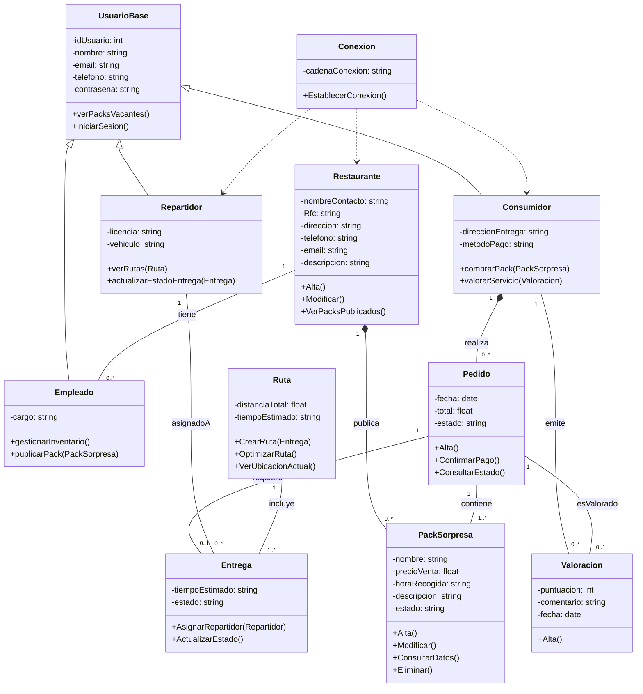

```mermaid
classDiagram
    direction TB

    %% Clases de Roles (Actores)
    class UsuarioBase {
        -idUsuario: int
        -nombre: string
        -email: string
        -telefono: string
        -contrasena: string
        +verPacksVacantes()
        +iniciarSesion()
    }

    class Consumidor {
        -direccionEntrega: string
        -metodoPago: string
        +comprarPack(PackSorpresa)
        +valorarServicio(Valoracion)
    }

    class Empleado {
        -cargo: string
        +gestionarInventario()
        +publicarPack(PackSorpresa)
    }

    class Repartidor {
        -licencia: string
        -vehiculo: string
        +verRutas(Ruta)
        +actualizarEstadoEntrega(Entrega)
    }

    %% Clases de Entidad (Datos del Negocio)
    class Restaurante {
        -nombreContacto: string
        -Rfc: string
        -direccion: string
        -telefono: string
        -email: string
        -descripcion: string
        +Alta()
        +Modificar()
        +VerPacksPublicados()
    }

    class PackSorpresa {
        -nombre: string
        -precioVenta: float
        -horaRecogida: string
        -descripcion: string
        -estado: string
        +Alta()
        +Modificar()
        +ConsultarDatos()
        +Eliminar()
    }

    class Pedido {
        -fecha: date
        -total: float
        -estado: string
        +Alta()
        +ConfirmarPago()
        +ConsultarEstado()
    }

    class Entrega {
        -tiempoEstimado: string
        -estado: string
        +AsignarRepartidor(Repartidor)
        +ActualizarEstado()
    }

    class Ruta {
        -distanciaTotal: float
        -tiempoEstimado: string
        +CrearRuta(Entrega)
        +OptimizarRuta()
        +VerUbicacionActual()
    }

    class Valoracion {
        -puntuacion: int
        -comentario: string
        -fecha: date
        +Alta()
    }

    class Conexion {
        -cadenaConexion: string
        +EstablecerConexion()
    }

    %% RELACIONES
    UsuarioBase <|-- Consumidor
    UsuarioBase <|-- Empleado
    UsuarioBase <|-- Repartidor

    Consumidor "1" *-- "0..*" Pedido : realiza
    Pedido "1" -- "0..1" Entrega : requiere
    Repartidor "1" -- "0..*" Entrega : asignadoA
    Restaurante "1" -- "0..*" Empleado : tiene
    Restaurante "1" *-- "0..*" PackSorpresa : publica

    Pedido "1" -- "1..*" PackSorpresa : contiene

    Consumidor "1" -- "0..*" Valoracion : emite
    Pedido "1" -- "0..1" Valoracion : esValorado

    Ruta "1" -- "1..*" Entrega : incluye

    Conexion ..> Consumidor
    Conexion ..> Restaurante
    Conexion ..> Repartidor
```

